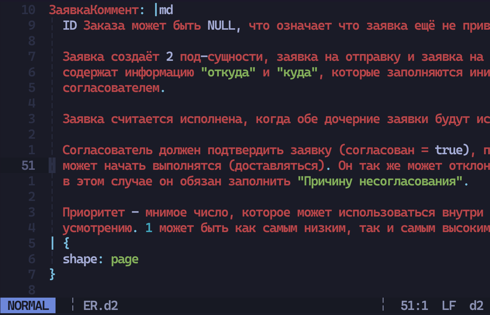
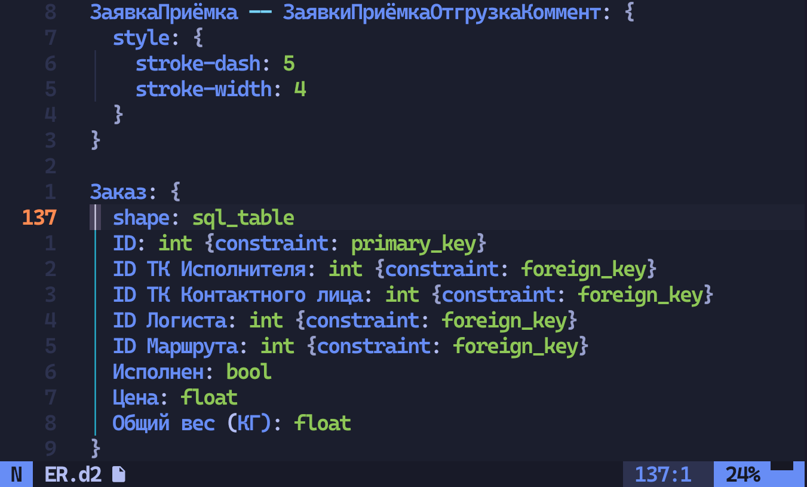
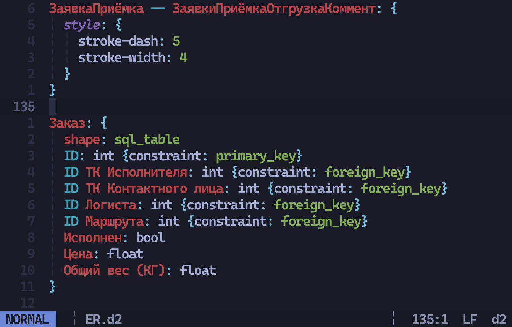

# tree-sitter-d2

[](https://github.com/ravsii/tree-sitter-d2/actions/workflows/build.yml)
[](https://github.com/ravsii/tree-sitter-d2/actions/workflows/test.yml)

This is an alternative to pleshevskiy's [tree-sitter-d2] (up to date version on his own [git]).

[tree-sitter-d2]: https://github.com/pleshevskiy/tree-sitter-d2
[git]: (https://git.pleshevski.ru/pleshevskiy/tree-sitter-d2)

_This is still in the development phase, but sort-of usable._

The goal is to provide better experience for existing keywords, code blocks
injections, folds, etc.

---

_I've never done anything remotely close to parsing grammar, so there could be
some bad patterns and simply bad code. Feel free to open issues._

## Why?

So there's already a tree-sitter grammar for d2, why make another one?

Here's a list of comparisons (as of 31.12.2024), both using `Tokyonight Storm`
theme.

Please note that:

- Queries (highlighting) is done at a very basic level, and the main focus at
  the moment is parsing grammar.
- All the examples are from my random university homework, thus being in
  Russian, please don't try make sense of them. Thanks! :D

### Better handling of languages

pleshivsky's version handles other locales and spaces very poorly.

| `nvim` + this project               | `helix` + pleshivky's grammar            |
| ----------------------------------- | ---------------------------------------- |
|  |  |

- Markdown is a mess
- Missing highlights for `shape`
- Note that text on the right is red, meaning it was not parsed correctly and
  throws an `@error` instead ([this rule])

[this rule]: https://git.pleshevski.ru/pleshevskiy/tree-sitter-d2/src/branch/main/queries/highlights.scm#L61

### Various missing highlights

| `nvim` + this project               | `helix` + pleshivky's grammar            |
| ----------------------------------- | ---------------------------------------- |
|  |  |

- `ID` for some reason being parsed as a _special_ keyword
- Highlighting of `style` block is inconsistent.
- Yet again, a lot of `@error`'s

## Installation

### Neovim

1. Add this to your config, after installing [nvim-treesitter]

[nvim-treesitter]: https://github.com/nvim-treesitter/nvim-treesitter

```lua
local parser_config = require("nvim-treesitter.parsers").get_parser_configs()
parser_config.d2 = {
  install_info = {
    url = "https://github.com/ravsii/tree-sitter-d2",
    files = { "src/parser.c" },
  },
  filetype = "d2",
}

-- in case `echo &filetype` is empty on *.d2
-- so we need to add auto set ft=d2 on *.d2 files
vim.filetype.add({
  extension = {
    d2 = "d2",
  },
})
```

2. Do

```bash
TSInstall d2
```

3. Copy queries to your `nvim-treesitter`. It should be located under your
   plugins manager directory.

   i.e. for `lazy.nvim` it's `~/.local/share/nvim/lazy`, so the directory
   should like like this:

```text
~/.local/share/nvim/lazy/nvim-treesitter/queries/d2
├── highlights.scm
├── injections.scm
└── locals.scm
```

4. `TSModuleInfo` should have `highlight` option enabled.

### Helix

Fortunately Helix has it's own [guide] on how to add new languages and
grammars.

[guide]: https://docs.helix-editor.com/guides/adding_languages.html

A quick example for installing `d2` would be:

1. Add new language to `languages.toml`

```toml
[[language]]
name = "d2"
scope = "source.git"
file-types = ["d2"]
comment-token = "#"
roots = [""]
indent = { tab-width = 2, unit = "  " }

[[grammar]]
source = { git = "https://github.com/ravsii/tree-sitter-d2" }
name = "d2"

```

2. `hx --grammar fetch` && `hx --grammar build`
3. Add your queries to `~/.config/helix/runtime/queries/d2`

```text
~/.config/helix/runtime/queries/d2
├── highlights.scm
├── injections.scm
└── locals.scm
```
