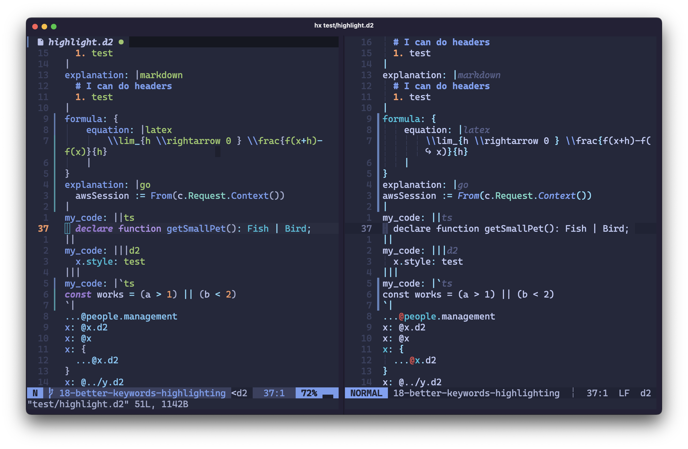
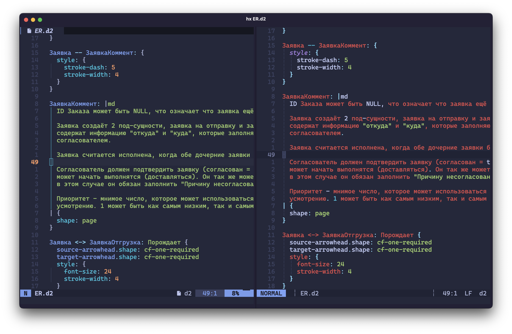
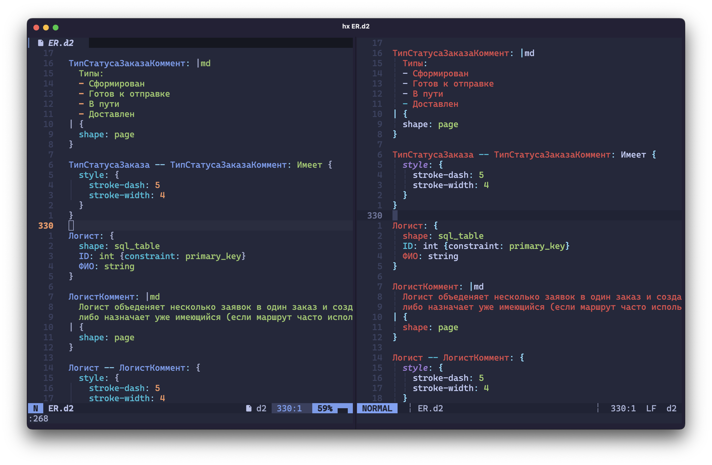

# tree-sitter-d2

[](https://github.com/ravsii/tree-sitter-d2/actions/workflows/build.yml)
[](https://github.com/ravsii/tree-sitter-d2/actions/workflows/test.yml)

## Table of Contents

<!--toc:start-->

- [tree-sitter-d2](#tree-sitter-d2)
  - [Table of Contents](#table-of-contents)
  - [Description](#description)
  - [Installation](#installation)
    - [Neovim](#neovim)
    - [Helix](#helix)
    - [Other editors](#other-editors)
  - [Showcase](#showcase)
  - [Contribution](#contribution)
  - [Comparison](#comparison)
    - [Better consistency overall](#better-consistency-overall)
    - [Better handling of foreign languages](#better-handling-of-foreign-languages)
    <!--toc:end-->

## Description

Tree Sitter grammar for [d2lang] \([github]\). It's not yet finished, but
usable for everyday cases with support for latest features like globs, filters
and variables.

The goal is to provide a better experience for existing keywords, code blocks
injections, folds, etc.

- **Better parsing of modern structures** - The latest supported version of d2
  is **v0.7.0**.
- **Built with [nvim-treesitter] in mind** - We respect and follow its
  [highlight] groups.
- **Keywords** - _All_ keywords from the documentation are treated as such.
  (Open an issue if any are missing.)
- **Tests** - We aim to cover all edge cases and examples from the
  documentation, resulting in more robust parsing. Currently, we have more
  than 100 tests. (This will be reduced later when the grammar becomes stable.)

[highlight]: https://neovim.io/doc/user/treesitter.html#treesitter-highlight-groups
[d2lang]: https://d2lang.com/
[github]: https://github.com/terrastruct/d2

---

_I've never done anything remotely close to parsing grammar, so there could be
some bad patterns and simply bad code. Feel free to open issues._

## Installation

### Neovim

_via [lazy.nvim]_

```lua
{
  "ravsii/tree-sitter-d2",
  dependencies = { "nvim-treesitter/nvim-treesitter" },
  build = "make nvim-install",
},
```

And then `:TSInstall d2`. After reloading Neovim everything should be working.

[lazy.nvim]: https://github.com/folke/lazy.nvim

### Helix

Fortunately Helix has its own [guide] on how to add new languages and grammars.

[guide]: https://docs.helix-editor.com/guides/adding_languages.html

A quick example for installing `d2` would be:

1. Add a new language to `languages.toml`

```toml
[[language]]
name = "d2"
scope = "source.git"
file-types = ["d2"]
comment-token = "#"
roots = [""]
indent = { tab-width = 2, unit = "  " }

[[grammar]]
source = { git = "https://github.com/ravsii/tree-sitter-d2", rev = "main" }
name = "d2"

```

2. `hx --grammar fetch` && `hx --grammar build`
3. Add your queries to `~/.config/helix/runtime/queries/d2`

```text
~/.config/helix/runtime/queries/d2
├── highlights.scm
├── injections.scm
└── locals.scm
```

> [!WARNING]  
> We found out that Helix is using `tree-sitter v0.22.x` which makes it
> incompatible with this grammar, as it was built using `tree-sitter v0.25.x`.
>
> If the highlighting doesn't work **AND** `:log-open` has this error:
>
> ```text
> Incompatible language version 15. Expected minimum 13, maximum 14
> ```
>
> then try using these options
>
> ```bash
> [[grammar]]
> source = { git = "https://github.com/ravsii/tree-sitter-d2", rev = "main-helix" }
> name = "d2"
> ```
>
> For more info see: <https://github.com/ravsii/tree-sitter-d2/issues/102>

### Other editors

If you're using some other editor that uses tree-sitter, please open an issue.
Would be great if you could also provide instructions for others how to install
it.

[nvim-treesitter]: https://github.com/nvim-treesitter/nvim-treesitter

## Showcase

`Tokyo Night Storm` theme with `CaskaydiaCove` font.

_Props to Neovim's Tokyo Night theme for supporting pretty much every
[highlighting group]._

[highlighting group]: <https://neovim.io/doc/user/treesitter.html#_treesitter-queries:~:text=the%20exact%20definition)%3A-,%40variable,-various%20variable%20names>

<https://github.com/user-attachments/assets/a9bd20d0-eb6c-43c2-8e58-7d211d350025>

## Contribution

See [CONTRIBUTION.md](/CONTRIBUTING.md)

## Comparison

> [!NOTE]
> This section is left "as is" from the very early development. It's outdated
> and not maintained, but it should give you a good perspective on the differences
> between these two grammars.

Actually, there's another [tree-sitter-d2] by pleshevskiy. My project's initial
goal was to fix issues his grammar had, but later I realized that his grammar
is not maintained and lacks many features `d2` has added since then.

Here's a list of comparisons as of `v0.2` version of this project, both using
`Tokyonight Storm` theme.

Please note that:

- On the left is our project using Neovim, on the right is pleshevskiy's
grammar using [Helix] (I was unable to install pleshevskiy's grammar in Neovim)
- Some examples are my random homework, thus being in Russian, please don't try
to make sense of them. Thanks! :D

[Helix]: https://helix-editor.com/
[tree-sitter-d2]: https://github.com/pleshevskiy/tree-sitter-d2

### Better consistency overall




### Better handling of foreign languages



