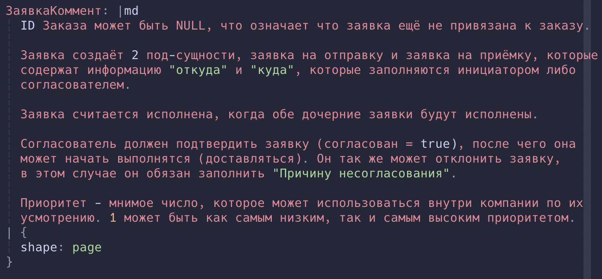
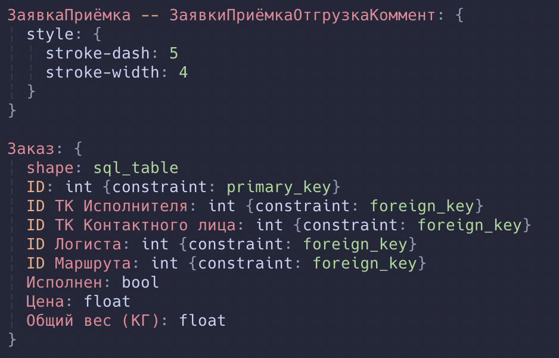

# tree-sitter-d2

This is an alternative to pleshevskiy's [tree-sitter-d2](https://github.com/pleshevskiy/tree-sitter-d2) ([updated version](https://git.pleshevski.ru/pleshevskiy/tree-sitter-d2)).

**WIP, THIS IS NOT USABLE YET**, but you can check the progress at `dev` branch.

## There's an alternative, why?

pleshivsky's version handles other locales and spaces very poorly.

Markdown is just a mess:


Missing highlighting on `style` block, ID and cyrillic using differeny scopes. Second shape (`Заказ`) is parsed as `ERROR`, but it's obviously correct.


##  Progress

At the moment it doesn't do much, but at least the code below will be parsed correctly.

Example:
```d2
direction: down
Инициатор: {
  shape: sql_table
  Фамилия Test: string
}
```

Example tree:
```
(source_file [0, 0] - [4, 0]
(direction [0, 0] - [0, 15]
  (colon [0, 9] - [0, 10])
  (whitespace [0, 10] - [0, 11])
  (direction_opts [0, 11] - [0, 15]))
(newline [0, 15] - [1, 0])
(shape_declaration [1, 0] - [4, 1]
  (identifier [1, 0] - [1, 18])
  (colon [1, 18] - [1, 19])
  (shape_body [1, 19] - [4, 1]
    (whitespace [1, 21] - [2, 2])
    (shape_param [2, 2] - [2, 18]
      (identifier [2, 2] - [2, 7])
      (colon [2, 7] - [2, 8])
      (param_value [2, 9] - [2, 18]))
    (whitespace [2, 18] - [3, 2])
    (shape_param [3, 2] - [3, 29]
      (identifier [3, 2] - [3, 21])
      (colon [3, 21] - [3, 22])
      (param_value [3, 23] - [3, 29]))
    (whitespace [3, 29] - [4, 0])))
```

## Note

I've never done anything remotely close to parsing grammar, so there could be some bad patterns and simply bad code. Feel free to open issues.
