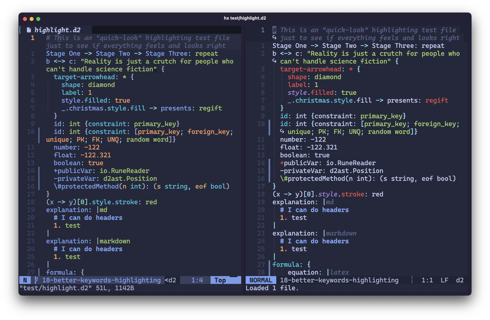

# tree-sitter-d2

[](https://github.com/ravsii/tree-sitter-d2/actions/workflows/build.yml)
[](https://github.com/ravsii/tree-sitter-d2/actions/workflows/test.yml)

This is an alternative to pleshevskiy's [tree-sitter-d2] (up to date version on
his own [git]).

It's usable, but not yet finished

The goal is to provide better experience for existing keywords, code blocks
injections, folds, etc.

[tree-sitter-d2]: https://github.com/pleshevskiy/tree-sitter-d2
[git]: https://git.pleshevski.ru/pleshevskiy/tree-sitter-d2

---

_I've never done anything remotely close to parsing grammar, so there could be
some bad patterns and simply bad code. Feel free to open issues._

## Why?

So there's already a tree-sitter grammar for d2, why make another one?

1. **The other one simply doesn't work** - On the latest stable version of
   Neovim (v10.3 as of now), you'll probably encounter [this] error.
1. **Better parsing of modern structures** - The latest supported version of d2
   is **v0.6.8**.
1. **Built with [nvim-treesitter] in mind** - We respect and follow its
   [highlight] groups.
1. **Keywords** - _All_ keywords from the documentation are treated as such.
   (Open an issue if any are missing.)
1. **Tests** - We aim to cover all edge cases and examples from the
   documentation, resulting in more robust parsing. Currently, we have more
   than 80 tests. (This will be reduced later when the grammar becomes stable.)

[this]: https://github.com/nvim-treesitter/nvim-treesitter/discussions/4598
[highlight]: https://neovim.io/doc/user/treesitter.html#_treesitter-queries

## Comparison

Here's a list of comparisons, both using `Tokyonight Storm` theme.

Please note that:

- On the left is our project using Neovim, on the right is pleshivsky's
  grammar using [Helix] (I was unable to install pleshevskiy's grammar in Neovim)
- Some example are my random homework, thus being in Russian, please don't try
  make sense of them. Thanks! :D

[Helix]: https://helix-editor.com/

### Better consistency overall




### Better handling of foreign languages


## Installation

### Neovim

1. Add this to your config, after installing [nvim-treesitter]

```lua
local parser_config = require("nvim-treesitter.parsers").get_parser_configs()
parser_config.d2 = {
  install_info = {
    url = "https://github.com/ravsii/tree-sitter-d2",
    files = { "src/parser.c" },
  },
  filetype = "d2",
}

-- in case `echo &filetype` is empty on *.d2
-- so we need to add auto set ft=d2 on *.d2 files
vim.filetype.add({
  extension = {
    d2 = "d2",
  },
})
```

2. Do `:TSInstall d2`
3. Copy queries to one of your `rtp` paths. Usually `~/.config/nvim/` will do
   the job. You can check it using `:echo &rtp` command.

Example using `~/.config/nvim`

```text
~/.config/nvim/queries/d2
├── highlights.scm
├── injections.scm
└── locals.scm
```

Example using default [nvim-treesitter] dir with [lazy.nvim]

```text
~/.local/share/nvim/lazy/nvim-treesitter/queries/d2
├── highlights.scm
├── injections.scm
└── locals.scm
```

4. Check if `:TSModuleInfo` has `highlight` option enabled.

[lazy.nvim]: https://github.com/folke/lazy.nvim

### Helix

Fortunately Helix has it's own [guide] on how to add new languages and
grammars.

[guide]: https://docs.helix-editor.com/guides/adding_languages.html

A quick example for installing `d2` would be:

1. Add new language to `languages.toml`

```toml
[[language]]
name = "d2"
scope = "source.git"
file-types = ["d2"]
comment-token = "#"
roots = [""]
indent = { tab-width = 2, unit = "  " }

[[grammar]]
source = { git = "https://github.com/ravsii/tree-sitter-d2" }
name = "d2"

```

2. `hx --grammar fetch` && `hx --grammar build`
3. Add your queries to `~/.config/helix/runtime/queries/d2`

```text
~/.config/helix/runtime/queries/d2
├── highlights.scm
├── injections.scm
└── locals.scm
```

[nvim-treesitter]: https://github.com/nvim-treesitter/nvim-treesitter
